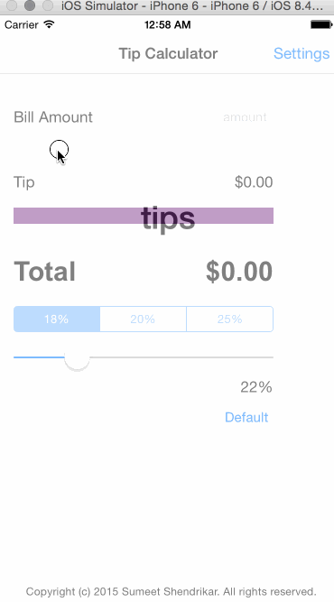

# TipCalc

Tip Calculator application

Time Spent: 12 hours, most of which was spent reading about the swift language

* [x] changed the tip percentage to a slider
* [x] added settings transition
* [x] added default tip percentage that is persisted across restart

Walkthrough

